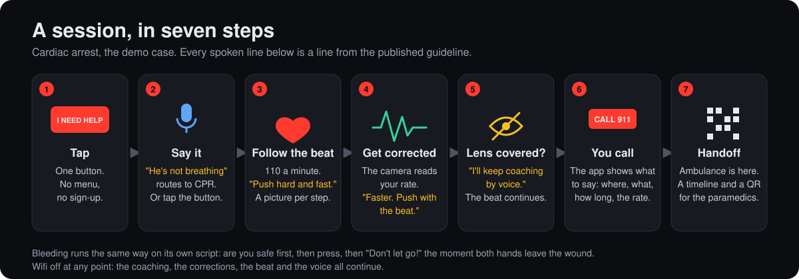
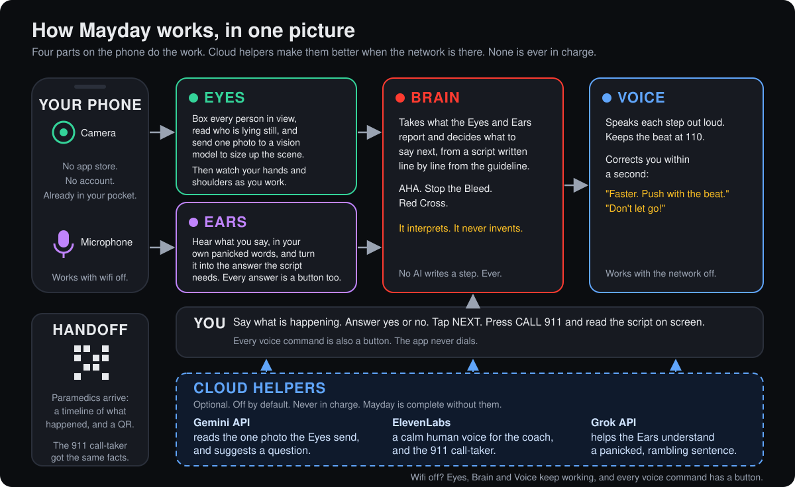
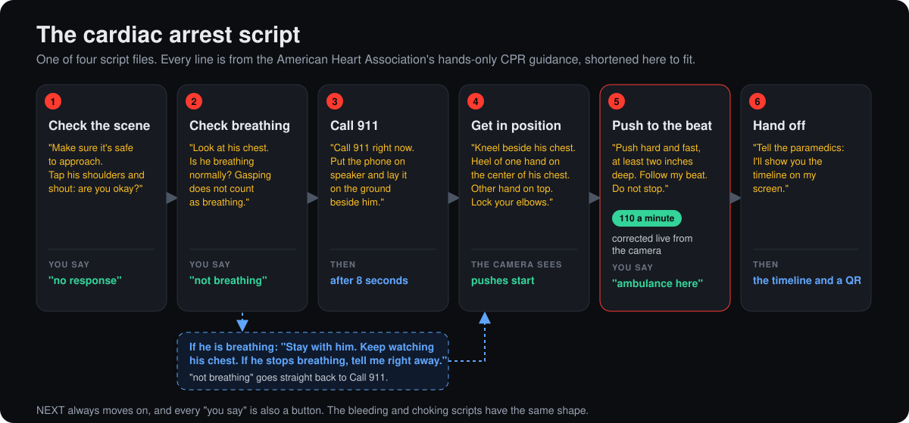

<h1 align="center">
  
  Mayday
</h1>

<p align="center"><strong>The minutes before the ambulance, coached.</strong></p>

<p align="center">
  
  
  <a href="LICENSE"></a>
</p>

> Built at HopHacks 2026, Johns Hopkins, September 18 to 20, for the Most Philanthropic Hack
> track, with the Gemini API, ElevenLabs and SpaceXAI sponsor challenges.

Mayday turns a phone into a first-aid coach that can see. When someone collapses or is bleeding
badly, a bystander with no training opens it, says what is happening, props the phone up, and
the app talks them through the right steps until the ambulance arrives. The camera watches the
whole time: it counts chest compressions and says "faster", and it notices hands leaving a
wound and says "press". When the paramedics arrive, it shows them a timeline of what happened.

Every step it speaks is a line from a published first-aid guideline, written into the app as a
script. No AI makes up a step. The camera and the coaching run on the phone and keep working
with the network off. The app never dials 911; it puts a big CALL 911 button on the screen and
tells the person what to say.

## 🚨 The problem

A man collapses in a hallway. The woman next to him has never done CPR. The 911 dispatcher
tells her to push on his chest, hard and fast, but cannot see whether she is, and she cannot
tell. The ambulance is seven minutes away. If he is bleeding instead, she presses a cloth on
the wound and, within seconds, lifts it to look, which is the one thing that lets the bleeding
start again.

<p align="center">
  
</p>

| The gap | Number | Source |
|---|---|---|
| Cardiac arrests outside a hospital in the US each year | more than 350,000, and under 10% survive | [American Heart Association](https://cpr.heart.org/en/resources/cpr-facts-and-stats) |
| What CPR from a bystander does to survival | doubles or triples it | [American Heart Association](https://cpr.heart.org/en/resources/cpr-facts-and-stats) |
| Victims who get CPR from a bystander before help arrives | about 40% | [American Heart Association](https://cpr.heart.org/en/resources/cpr-facts-and-stats) |
| Time from the 911 call to the ambulance on scene | 7 minutes in the middle, 13 in rural areas | [JAMA Surgery, 2017](https://jamanetwork.com/journals/jamasurgery/fullarticle/2643992) |
| How fast severe bleeding can kill | as little as 5 minutes | [American College of Surgeons, Stop the Bleed](https://www.facs.org/media-center/press-releases/2025/may-is-national-stop-the-bleed-month-learn-how-to-save-a-life-with-three-simple-actions/) |

The knowledge that closes this gap is public and free: the American Heart Association's
hands-only CPR, the American College of Surgeons' Stop the Bleed, the Red Cross choking steps.
What does not exist is a way to put it in a frightened stranger's hands in the minutes that
matter, with no training, no account, no signal, and someone watching whether they are doing it
right. Video from the caller's phone to a dispatcher has been shown to change the assessment in
half of real calls ([BMC Emergency Medicine, 2021](https://link.springer.com/article/10.1186/s12873-021-00493-5)),
and an AI coach has out-performed dispatchers over audio ([JAMA Internal Medicine, 2026](https://today.ucsd.edu/story/ai-powered-cpr-coach-outperforms-911-dispatchers-in-guiding-bystander-resuscitation)).
Mayday puts the eyes on the phone itself.

This is a philanthropy problem before it is a technology problem. It falls hardest on the people
with the least: no training, no equipment, an ambulance thirteen minutes away. Mayday costs
nothing, needs no account or app store, works without a signal, teaches the real guideline every
time it is used, and is open source so any community can add the emergency it faces most.

## 💡 What a session looks like

<p align="center">
  
</p>

One tap starts it. Say what is happening, or tap the matching button; a panicked sentence the
app does not recognize becomes a "Sounds like Not breathing?" question. Then big text, a
picture for every step, a beat at 110 a minute, and corrections within a second read from your
shoulders. Cover the lens and it says so and keeps coaching by voice. Press CALL 911 and it
tells you what to say. When the ambulance arrives, it hands over a timeline and a QR code.

Bleeding runs on its own script: are you safe first, with no timer, then a circle locked around
the wound where your hands settle, and "Don't let go!" within about two seconds of both hands
leaving it.

**Demo video:** the link lands with the Devpost submission.

## 🏗️ How it works

<p align="center">
  
</p>

Facts flow one way. The Eyes report measurements, never advice. The Brain turns measurements
into the guideline's own words. The Voice says only what the Brain hands it. Everything is
logged, and the report for the paramedics is built from that log, so it can only claim what the
session recorded.

## 🧭 Why you can trust it

Five rules the app is built around. Breaking one is a bug even if the feature works, and each
is enforced by a test a judge can open.

| Rule | In plain words | How the code enforces it |
|---|---|---|
| **Authority is deterministic** | Every instruction is a line a human transcribed from AHA, Stop the Bleed or the Red Cross. AI may sort or reword; it never picks or invents a step. | The build fails on a medical step with no cited guideline. A reworded line is checked for the words the step requires, and the original plays if the check fails. The engine may not read the clock, the network or a random number. |
| **Reflexes are local** | Camera to correction runs on the phone. Wifi off mid-session changes nothing in the coaching. | A test scans the coaching path for network calls. |
| **Cognition is episodic** | The cloud gets one photo at the start and one sentence when the app did not understand you. Never in the loop. No answer in time, nothing happens. | The camera, script and voice code cannot import the AI module. Every cloud call has a timeout and a local fallback. |
| **Fail loud, never wrong** | When the camera cannot see well, the numbers go blank, the app says so, and coaching continues by voice. Unwatched time is reported as unmeasured, never as a pause. | While blind, only lines marked safe may play. Unmeasured time is a named field in the report. |
| **A human dials 911** | The app never places a call. The call-taker in the demo is simulated, and the launch screen says so once. | A test fails on any phone-dialing code, requires the disclosure on the launch screen, and forbids the word "simulated" on the call itself. |

The numbers behind that: 326 tests, four scripts with every medical step citing a live
guideline page, an engine of 279 lines with no dependencies, and zero network calls in the
coaching loop.

## 📜 Where every step comes from

Each emergency is one script file: the steps in order, the exact words to say for each, the
beat, the correction rules, and which answer leads where. Every medical step cites the guideline
page it was transcribed from, and the build fails if one does not. The engine that walks the
script knows nothing about any particular emergency, so a new emergency is a new file, not new
code.

<p align="center">
  
</p>

Every "you say" is also a button, and NEXT always moves on, so the whole script can be driven by
tapping. Untrained bystanders get hands-only CPR, no rescue breaths, as the AHA teaches. The
bleeding and choking scripts have the same shape.

## 👀 What the camera measures

Google's MediaPipe pose and hand tracking runs inside the browser, models included in the app,
so no video ever leaves the phone. It watches the helper, not the patient.

| It measures | How | Which becomes |
|---|---|---|
| Compression rate | the up-and-down of the helper's shoulders, peaks counted | "Faster. Push with the beat." or "A little slower." |
| Still pushing | at least two pushes in the last two seconds | "Don't stop. Keep pushing. Help is coming." |
| Chest recoil | how far the chest comes back up between pushes, an estimate | "Let the chest come all the way back up." |
| Hands on the wound | palms inside a circle locked where they first settled | "Don't let go! Hands back on the wound." |
| Confidence | whether the shoulders are visible enough to trust | the "I can't see you clearly" line, and the beat continues |
| Someone down | a body lying flat and still for two seconds | "Looks like Collapsed?", a question |

## 🗣️ How it talks and listens

One voice, three levels of urgency: a critical line interrupts, a correction replaces an older
version of itself, instructions wait their turn and are never dropped. The beat runs on the
audio clock so a busy camera cannot make it stutter. Listening is keyword spotting only, the
answers the current step accepts, and every keyword also has a button. The default voice is the
browser's own, which needs no key and no network. Every line has a hand-drawn picture; browse
them at `?guide=1`.

## 🤝 Sponsor challenges

**Best Use of Gemini API.** About a second into a session, one photo goes to Gemini with a strict
question: collapse, bleeding, choking, or unclear. The answer becomes a spoken question, "It
looks like someone is bleeding badly. Say yes, or tap.", and nothing moves until the person says
yes. When they say something the app has no phrase for, Gemini picks which on-screen button they
meant, so it can suggest but never invent a step.

**Best Use of ElevenLabs, Best Project Built with ElevenLabs.** The coach speaks as Brian, a low,
calm voice, with every line cached at launch so it keeps playing with wifi off. The 911
call-taker speaks as Sarah, a clearly different person, and with the live agent switched on it
is a real-time ElevenLabs Agents conversation that hears the phone's mic and is forbidden from
giving medical advice.

**Make it Legendary, SpaceXAI.** The Grok API takes the audio. What the bystander says into the
phone's microphone goes through Grok, so a panicked, rambling sentence reaches the app as words
it can act on. Landing now on a teammate's branch.

All three are off by default, keep their keys on the server, and fall back to the phone's own
voice, ears and cues, so the app is complete without them.

## 🚀 Run it

Needs Node 20.19 or newer and Chrome. The dev server serves self-signed HTTPS for the camera;
accept the warning once per device, scan the QR it prints with a phone on the same wifi, and
"Add to Home Screen".

```bash
npm install
```

```bash
npm run dev
```

| URL | What you get |
|---|---|
| plain | the real app |
| `?fake=1` | the whole loop on a laptop with no camera: a rate slider, cover the lens, lift hands |
| `?debug=1` | the sensor view: skeleton, waveform, rate, confidence |
| `?guide=1` | every step picture, no camera needed |
| `?flag=elevenLabs,dispatcherSim,sceneAssess,intentRoute` | the cloud helpers, any subset |

Keys go in `.env.local`, copied from `.env.example`: `GEMINI_API_KEY` for the photo and the
sentence matching, `ELEVENLABS_API_KEY` for the voices, `ELEVENLABS_AGENT_ID` for the live
call-taker. They never reach the browser. The phone notes, the walkthrough for each switch and
the checks the team walks before a judged run are in
[docs/12-run-and-check.md](docs/12-run-and-check.md).

## 🗂️ Repo layout

```
mayday/
├── src/                     the engine, no browser code in here
│   ├── perception/          camera, pose and hand tracking, the signals (docs/03)
│   ├── protocol/            the state machine engine, the linter, the paraphrase validator (docs/02)
│   │   └── machines/        one data file per emergency: triage, cardiac, bleeding, choking
│   ├── voice/               speaking (queue, metronome) and listening (keyword spotting) (docs/04, docs/09)
│   │   └── providers/       the one place a network call is allowed: ElevenLabs voice and agent, the key proxy
│   ├── ai/                  the cloud helpers behind interfaces: scene photo, sentence matching (docs/04, docs/11)
│   └── sitrep/              the event log, the SITREP, the paramedic handoff
├── web/                     the browser app
│   ├── session.ts           the orchestrator: where camera, engine, voice and log meet (docs/10)
│   ├── providers.ts         local by default, cloud behind a switch, chosen once per session
│   ├── geocode.ts           turns the GPS fix into a street address for the SITREP
│   └── ui/
│       ├── LaunchScreen.tsx, CameraView.tsx, DebugScreen.tsx, Waveform.tsx
│       ├── live/            the live screen: LiveApp, DispatcherPanel, HandoffPanel, useSession
│       └── guide/           one picture per line, gallery at ?guide=1 (docs/05)
├── docs/                    the context documents, reading order below
│   └── images/              the diagrams in this README
├── public/
│   ├── models/              MediaPipe model files, committed, nothing fetched at runtime
│   └── wasm/                MediaPipe runtime, generated on install, gitignored
├── scripts/                 prepare-assets, check-ai-boundaries, assess-frame, create-dispatcher-agent
└── tests/                   engine, scripts, keywords, validator, SITREP, boundaries, diagrams
```

## 📚 Docs

In reading order: [CLAUDE.md](CLAUDE.md) for the five rules and the scope,
[docs/01-architecture.md](docs/01-architecture.md) for the data flow and the threat model,
[docs/02-protocols.md](docs/02-protocols.md) for every script with its guideline,
[docs/03-perception.md](docs/03-perception.md) for the camera signals,
[docs/04-voice-and-apis.md](docs/04-voice-and-apis.md) for the voice queue and the AI seams,
[docs/05-ui-demo.md](docs/05-ui-demo.md) for the screens and the demo contract,
[docs/11-scene-assessment.md](docs/11-scene-assessment.md) for the research behind the eyes,
[docs/12-run-and-check.md](docs/12-run-and-check.md) for the run guide, and
[DECISIONS.md](DECISIONS.md) for every choice the docs did not settle.

## 👥 Team

- [Emmanuel Adedeji](https://www.linkedin.com/in/e-adedeji/)
- [Bryce Biyeba](https://www.linkedin.com/in/bryce-biyeba/)
- [Ricky Chen](https://www.linkedin.com/in/ricky-ch3n/)
- [Israel Ogwu](https://www.linkedin.com/in/israelogwu/)

## 📄 License

Apache License 2.0, full text in `LICENSE`. Attribution and the redistribution notice are in
`NOTICE`; keep that file with any copy or derivative you ship.

Mayday is a demonstration, not a certified medical device and not a substitute for emergency
medical services. The simulated dispatcher is never connected to a real emergency line. The
software is provided "as is", without warranty of any kind (LICENSE, Sections 7 and 8).
