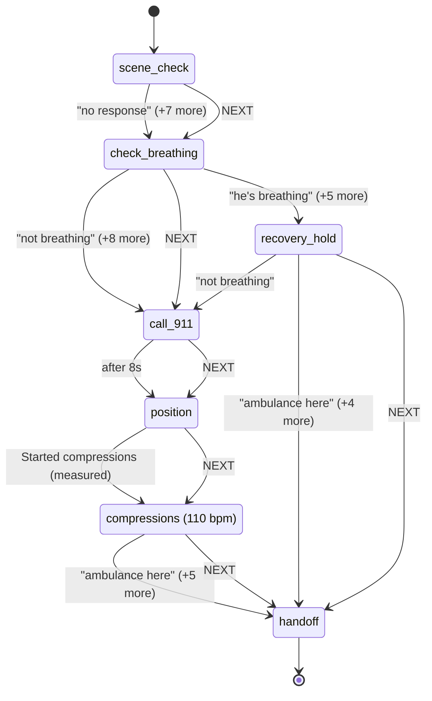

<p align="center">
  
</p>

<h1 align="center">Mayday</h1>

<p align="center"><strong>The minutes before the ambulance, coached.</strong></p>

<p align="center">
  <a href="https://hophacks-fall-2026.devpost.com/"></a>
  
  
  <a href="LICENSE"></a>
</p>

<p align="center">
  
  
  
  
  
</p>

Mayday turns a phone into a first-aid coach that can see. Someone collapses or is bleeding
badly. A bystander with no training opens Mayday, says what is happening or taps one button,
props the phone up, and the app talks them through the right steps until the ambulance
arrives. It watches through the camera the whole time: it counts their chest compressions and
tells them to speed up, and it notices when their hands leave a wound and tells them to press
again. When the paramedics arrive, it shows them a timeline of what happened.

Every instruction Mayday speaks comes from a published first-aid guideline, written into the
app as a script it follows line by line. No AI makes up a step. The camera and the coaching
run on the phone itself and keep working with the network off. Mayday never dials 911 on its
own; it puts a big CALL 911 button on the screen and tells the person what to say.

Built over the HopHacks 2026 weekend at Johns Hopkins (September 18 to 20) by four people, for
the Most Philanthropic Hack track.

## 🚨 The problem

A man collapses in a hallway. The woman next to him has never done CPR. She calls 911, and the
dispatcher tells her to push on the center of his chest, hard and fast. She cannot tell whether
she is pushing fast enough. The dispatcher cannot see her. The ambulance is seven minutes away.
If he is bleeding instead, she will press a cloth on the wound, and in a few seconds she will
lift it to look, which is the one thing that lets the bleeding start again.

<p align="center">
  
</p>

| The gap | Number | Source |
|---|---|---|
| Cardiac arrests outside a hospital in the US each year | more than 350,000, and under 10% survive | [American Heart Association](https://cpr.heart.org/en/resources/cpr-facts-and-stats) |
| What CPR from a bystander does to survival | doubles or triples it | [American Heart Association](https://cpr.heart.org/en/resources/cpr-facts-and-stats) |
| Victims who get CPR from a bystander before help arrives | about 40% | [American Heart Association](https://cpr.heart.org/en/resources/cpr-facts-and-stats) |
| Time from the 911 call to the ambulance on scene | 7 minutes in the middle, 13 in rural areas | [JAMA Surgery, 2017](https://jamanetwork.com/journals/jamasurgery/fullarticle/2643992) |
| How fast severe bleeding can kill | as little as 5 minutes | [American College of Surgeons, Stop the Bleed](https://www.facs.org/media-center/press-releases/2025/may-is-national-stop-the-bleed-month-learn-how-to-save-a-life-with-three-simple-actions/) |

The knowledge that closes this gap already exists, and it is free. The American Heart
Association publishes hands-only CPR for untrained people. The American College of Surgeons
publishes Stop the Bleed. The Red Cross publishes what to do for choking. What does not exist
is a way to put that knowledge in a frightened stranger's hands in the minutes that matter,
with no training, no account, no signal, and nobody to watch whether they are doing it right.

Why the gap stays open:

- **The dispatcher is blind.** Voice-only coaching is the standard of care. A few cities stream
  the caller's camera to the dispatcher, and it changed how the patient was assessed in half of
  838 real calls ([BMC Emergency Medicine, 2021](https://link.springer.com/article/10.1186/s12873-021-00493-5)),
  but it needs a trained human watching every stream.
- **Training fades.** Most people who once took a CPR class do not remember the rate, the depth
  or where to put their hands, and there is no time to look it up.
- **Distance.** The median ambulance takes seven minutes. In rural areas it takes thirteen, and
  one in ten waits close to half an hour. The people furthest from help are the ones who most
  need a coach in the room.

This is a philanthropy problem before it is a technology problem. The people it hurts most have
the least: no training, no equipment, no nearby hospital. Mayday costs nothing to use, needs no
account and no app store, works where there is no signal, teaches the real guideline every
time it is used, and is open source so any community can add the emergency it faces most.

The pieces have each been proven separately. Dispatcher-assisted CPR is standard practice.
ChatCPR showed an AI agent out-coaching human dispatchers over audio alone
([JAMA Internal Medicine, 2026](https://today.ucsd.edu/story/ai-powered-cpr-coach-outperforms-911-dispatchers-in-guiding-bystander-resuscitation)).
Mayday puts the eyes on the phone itself, keeps the medical steps in human-written scripts, and
needs no dispatcher to interpret the picture.

## 💡 What Mayday does about it

Three promises, in the order a bystander meets them:

1. **It gets you started in one tap.** No sign-up, no menu. Say what is happening or tap the
   button that matches. If you say it in your own panicked words, it asks "Sounds like Not
   breathing?" and waits for your yes.
2. **It coaches from the real guideline and watches you do it.** Big text, a picture for every
   step, a metronome at 110 beats a minute. The camera reads your rate from your shoulders and
   corrects you within a second. If it cannot see you, it says so and keeps coaching by voice.
3. **It never guesses and never dials.** Every spoken step is a line a human transcribed from
   the guideline. A model's guess about the scene becomes a question you answer, never an
   action. You press CALL 911, and the app tells you what to say.

<p align="center">
  
</p>

Bleeding works the same way with a different script: it asks whether you are safe first, with
no timer, then locks a circle around the wound where your hands settle, and says "Don't let go!
Hands back on the wound. Press harder." within about two seconds of both hands leaving it.

**Demo video:** the link lands with the Devpost submission.

## 🏗️ How it works

Three parts on the phone do the work. Two cloud services make it better when the network is
there, and neither is ever in charge.

<p align="center">
  
</p>

| Part | What it does | Where it runs |
|---|---|---|
| **Eyes** | Reads the helper's shoulders to count compressions and their rate, watches whether their hands stay on the wound, and says so out loud when the picture is not good enough to trust | on the phone, in the browser, no network |
| **Brain** | Follows the first-aid script one line at a time: what to say, when to start the beat, what counts as too slow, what the next step is | on the phone, plain data plus a small engine |
| **Voice** | Speaks each line, keeps the beat, interrupts with a correction when the Eyes report a problem | on the phone, the browser's own voice by default |
| **You** | Answer by voice or by tapping. NEXT always works. CALL 911 is always on screen | your thumb |
| **Gemini** | Looks at one photo at the start and suggests what kind of emergency it is, as a question | cloud, optional |
| **ElevenLabs** | Gives the coach a calm human voice and plays the 911 call-taker in the demo | cloud, optional |

Facts flow one way. The Eyes report measurements, never advice. The Brain turns measurements
into the guideline's own words. The Voice says only what the Brain hands it. Everything that
happens is logged, and the report for the paramedics is built from that log, so it can only
claim what the session recorded.

## 🧭 Why you can trust it: the five principles

These are the rules the app is built around. Breaking one is a bug even if the feature works.
Each is enforced by a test a judge can open, not by a comment.

| Principle | In plain words | How the code enforces it |
|---|---|---|
| **Authority is deterministic** | Every instruction is a line a human transcribed from AHA, Stop the Bleed or the Red Cross. AI may sort or reword; it never picks, orders or invents a step. | The build fails on a medical step with no cited guideline. A reworded line is checked for the words the step requires, and the original plays if the check fails. A test forbids the engine from reading the clock, the network or a random number. |
| **Reflexes are local** | Camera to correction runs on the phone. Turning wifi off mid-session changes nothing in the coaching. | A test scans the coaching path for network calls and fails if it finds one. |
| **Cognition is episodic** | The cloud gets one photo at the start and one sentence when the app did not understand you. Never in the loop. If it does not answer in time, nothing happens. | A check blocks the camera, script and voice code from importing the AI module. Every cloud call has a timeout and a local fallback. |
| **Fail loud, never wrong** | When the camera cannot see well, the numbers go blank, the app says "I can't see you clearly" and keeps coaching by voice. The paramedic report prints unwatched time as unmeasured, never as a pause. | Blindness is a rule of the engine: while blind, only lines marked safe may play. Unmeasured time is a named field in the report. |
| **A human dials 911** | The app never places a call. It shows a big CALL 911 button and a script to read aloud. The call-taker in the demo is simulated, and the launch screen says so once. | A test fails on any phone-dialing code, requires the disclosure on the launch screen, and forbids the word "simulated" on the call itself. |

By the numbers:

| | |
|---|---|
| Tests | 326, running in under one second |
| Emergency scripts | 4: triage, cardiac arrest, severe bleeding, choking. Every medical step cites a live guideline page |
| Engine | 279 lines plus a 63-line rule evaluator, no dependencies |
| Network calls in the coaching loop | 0, enforced by a test |
| Libraries in the app | React, MediaPipe, a QR code encoder |

## 📜 The protocols are data, not code

Each emergency is one file under `src/protocol/machines`, written as plain data: the steps, the
exact words to say for each, the metronome speed, the rules for corrections, and which answer
leads where. The engine that walks the steps knows nothing about any particular emergency.
Adding an emergency means adding one file with its guideline page and passing a checker. No
engine code changes.



The cardiac arrest script, drawn from its data file by `npm run diagrams`. Read it top to
bottom: check the scene, check breathing, call 911, get in position, push to the beat, hand off.
Every arrow is something the person can say, and every NEXT is a button on the screen. All four
scripts are in [docs/protocol-diagrams.md](docs/protocol-diagrams.md).

Choices inside the scripts, each defensible from its source:

- Untrained bystanders get hands-only CPR: compressions, no rescue breaths, as the AHA teaches.
- Scene safety in the bleeding script has no timeout. Only the human can say it is safe.
- A tourniquet is coached only if the person says they have a real one. No improvised belts.
- The choking script ships as data with the camera cue disabled. It is reached by voice or tap.
- Every line is written for the ear: short sentences, imperative, no jargon.

## 👀 What the camera measures

The camera watches the helper, not the patient. It runs Google's MediaPipe pose and hand
tracking inside the browser, with the models stored in the app, so nothing is fetched from the
internet while it works and no video ever leaves the phone. Each measurement becomes either a
line from the script or a question for the person.

| It measures | How | Which becomes |
|---|---|---|
| Compression rate | the up-and-down of the helper's shoulders, peaks counted, the middle of the last five gaps | "Faster. Push with the beat." or "A little slower." |
| Still pushing | at least two pushes in the last two seconds | "Don't stop. Keep pushing. Help is coming." |
| Chest recoil | how far the chest comes back up between pushes, an estimate and called one on stage | "Let the chest come all the way back up." |
| Hands on the wound | palms inside a circle locked where they first settled | "Don't let go! Hands back on the wound." |
| Confidence | whether the shoulders are visible enough to trust; if not for a second, every number goes blank | the "I can't see you clearly" line, and the beat continues |
| Someone down | a body lying flat and still for two seconds | "Looks like Collapsed?", a question |

Two people are usually in the frame, so the app picks the one kneeling over the patient and
measures them. A patient lying flat is never measured for coaching. Camera guidance ("Move the
phone closer", "It's too dark") plays at most once every ten seconds. Counting compressions
from a phone camera is a published measurement ([Meinich-Bache et al., 2018](https://www.ncbi.nlm.nih.gov/pmc/articles/PMC6277120/));
Mayday does it with pose tracking instead of pixels.

## 🗣️ How it talks and listens

**Talking.** One voice with three levels of urgency. A critical line interrupts whatever is
playing. A correction replaces an older version of itself and repeats at most once per
cooldown. Instructions are held until the voice is free, never dropped. A repeated correction
gets louder and sharper, with a tone before critical ones, and the words never change. The beat
runs on the audio clock, so a busy camera cannot make it stutter, and speech never pauses it.
The default voice is the browser's own, which needs no key and no network.

**Listening.** The app listens for keywords only: the answers the current step accepts, plus
"next" and "repeat", with extra phrases for the way people actually talk in a panic. Nothing
you say is sent to an AI with any say over the steps. Two layers of echo cancellation stop the
app from hearing itself. Every keyword also has a button, so the whole thing can be driven by
tapping.

**Pictures.** Every line has a hand-drawn picture, the way a workout app shows the movement next
to the cue. During compressions the figure pushes on the beat over a scrolling rhythm trace.
Browse them all at `?guide=1`.

## 🤝 The AI helpers, and the sponsor challenges they enter

Each cloud helper follows the same three rules: it is off unless a switch in the URL turns it
on, its key lives on the server and never in the app, and the app is complete without it.

| Challenge | What Mayday uses it for | Where | Without it |
|---|---|---|---|
| Best Use of Gemini API | Gemini looks at one photo at the start and suggests what kind of emergency it is. It also reads a sentence the app did not understand and points at the matching button | `src/ai/assess.ts`, `src/ai/intent.ts` | the camera's own cues and the buttons carry on |
| Best Use of ElevenLabs, Best Project Built with ElevenLabs | a calm human voice for the coach, a second voice for the call-taker, and a live simulated 911 call-taker that hears the phone's mic | `src/voice/providers/` | the browser's voice and a scripted call-taker |
| Most Philanthropic Hack (track) | the whole product | this repo | |

### Gemini API: a second pair of eyes, once

About a second after the person taps, one small photo goes to Gemini with a strict question:
is this a collapse, bleeding, choking, or unclear; how confident; one sentence about what is
visible; where the patient is in the picture; and whether any cloth is in reach to press on a
wound. Anything outside those answers is treated as unclear. A sentence that starts giving
advice is thrown away. The answer becomes a question the app asks out loud: "It looks like
someone is bleeding badly. Say yes, or tap." Nothing moves until the person says yes.

When the person says something the app has no phrase for, the same model gets the sentence and
the numbered list of buttons on the screen, and answers with a number. The app then offers
that button. A number that is not on the list, a low confidence, or no answer within three
seconds all mean nothing happens. Because the model can only ever pick from the buttons the
screen already shows, it cannot invent a step.

Both calls ask the model to classify, not to reason, so its thinking mode is off, which cut the
response from over three seconds to under one. `node scripts/assess-frame.mjs photo.jpg` runs
the exact question on any photo, which is how the team compared models before the demo.

### ElevenLabs: a human voice, and a persona per role

The coach speaks as Brian, a low, calm voice, about half a second from a line to sound. Every
line the scripts can say is generated once at launch and cached, so replays are instant and
keep playing in that voice with wifi off. If a line does not arrive within 0.8 seconds, the
browser's voice says it instead, so a bad connection costs one line at most. The 911 call-taker
speaks as Sarah, a clearly different person, so the call sounds like a call.

The coach's voice is a setting next to the key, not a menu in the app: a voice name or id from
the account's library, looked up once when the app starts. A voice picker inside the app was
built and removed the same evening, because a person in an emergency should configure nothing
between them and "I NEED HELP".

With the live call-taker switched on, CALL 911 opens a real-time ElevenLabs Agents conversation.
It hears the phone's microphone, asks for the location, what happened and how the patient is,
and its instructions forbid it from giving medical advice: it tells the person to keep following
the coaching they are hearing. If the microphone is refused or the connection drops, the
scripted call-taker takes over on the same panel.

## 🛡️ What Mayday refuses to do

- **Take a medical step because an AI said so.** A guess becomes a question. A reworded line is
  checked. The original line always exists and always wins.
- **Coach from a picture it cannot trust.** Blank numbers, a spoken warning, and unwatched time
  printed as unmeasured in the report. A frozen number can never coach.
- **Dial 911, or pretend to be 911.** The app never places a call. The call-taker in the demo is
  simulated, and the launch screen says so before anyone is in an emergency.
- **Keep or send the video.** Frames are processed in the browser and thrown away. One photo
  leaves the phone only if the Gemini switch is on, and one sentence only if the intent switch
  is on. No accounts, no database, no always-on listening.
- **Detect blood, measure depth or diagnose.** Blood detection fails under bad light and across
  skin tones. One camera cannot measure centimeters. A model's label is a cue for a question,
  never a diagnosis.
- **Claim "works offline" flatly.** The browser's speech recognition sends audio to Google, so
  voice input needs a network. Coaching, corrections, the beat and the voice do not, and every
  voice command has a button.

Said before anyone asks: Mayday is a coaching aid and a demonstration, not a medical device. A
real deployment would go through the software-as-a-medical-device pathway and plug into
dispatch through a platform such as RapidSOS.

## 🚀 Run it

Needs Node 20.19 or newer and Chrome. The camera needs a secure page, so the dev server serves
self-signed HTTPS: accept the warning once per device.

```bash
npm install
```

```bash
npm run dev
```

Vite prints `https://localhost:5173`, the address on your wifi, and a QR code. Scan the QR with
a phone on the same wifi, accept the certificate warning, then "Add to Home Screen" for a
fullscreen app. A plain load is the real app. These switches change what loads:

| URL | What you get |
|---|---|
| `?fake=1` | the whole loop on a laptop with no camera: a rate slider, stop pushing, cover the lens, lift hands, person down |
| `?debug=1` | the sensor view: skeleton, waveform, counted pushes, rate, confidence, the beat and voice test buttons |
| `?guide=1` | the step guide gallery, every picture for every line, no camera needed |
| `?flag=elevenLabs,dispatcherSim,sceneAssess,intentRoute` | the cloud helpers, any subset, each needing its key below |

Keys go in `.env.local`, copied from `.env.example`. With a key present, `npm run dev` also
serves the key proxy on the same address, so the phone reaches it over the same HTTPS URL and
the key never reaches the browser.

| Key | Turns on |
|---|---|
| `GEMINI_API_KEY` | the scene photo and the sentence matching, a free key from [AI Studio](https://aistudio.google.com/apikey) |
| `ELEVENLABS_API_KEY` | the coach and call-taker voices |
| `ELEVENLABS_AGENT_ID` | the live call-taker, created once with `node scripts/create-dispatcher-agent.mjs` |
| `ELEVENLABS_COACH_VOICE` | a different coach voice, by id or library name |

Other scripts: `npm test`, `npm run typecheck`, `npm run lint` (the AI boundary check),
`npm run build`, `npm run preview`, `npm run diagrams`. The full run guide, the phone and iPhone
notes, the walkthrough for each switch, and the checks the team walks before a judged run are in
[docs/12-run-and-check.md](docs/12-run-and-check.md).

## 🗂️ Repo layout

```
mayday/
├── src/                     the engine, no browser code in here
│   ├── perception/          camera, pose and hand tracking, the signals (docs/03)
│   ├── protocol/            the state machine engine, the linter, the paraphrase validator (docs/02)
│   │   └── machines/        one data file per emergency: triage, cardiac, bleeding, choking
│   ├── voice/               speaking (queue, metronome) and listening (keyword spotting) (docs/04, docs/09)
│   │   └── providers/       the one place a network call is allowed: ElevenLabs voice and agent, the key proxy
│   ├── ai/                  the cloud helpers behind interfaces: scene photo, sentence matching (docs/04, docs/11)
│   └── sitrep/              the event log, the SITREP, the paramedic handoff
├── web/                     the browser app
│   ├── session.ts           the orchestrator: where camera, engine, voice and log meet (docs/10)
│   ├── providers.ts         local by default, cloud behind a switch, chosen once per session
│   ├── geocode.ts           turns the GPS fix into a street address for the SITREP
│   └── ui/
│       ├── LaunchScreen.tsx, CameraView.tsx, DebugScreen.tsx, Waveform.tsx
│       ├── live/            the live screen: LiveApp, DispatcherPanel, HandoffPanel, useSession
│       └── guide/           one picture per line, gallery at ?guide=1 (docs/05)
├── docs/                    the context documents, reading order below
│   └── images/              the diagrams in this README
├── public/
│   ├── models/              MediaPipe model files, committed, nothing fetched at runtime
│   └── wasm/                MediaPipe runtime, generated on install, gitignored
├── scripts/                 prepare-assets, check-ai-boundaries, assess-frame, create-dispatcher-agent
└── tests/                   engine, scripts, keywords, validator, SITREP, boundaries, diagrams
```

## 📚 Docs

The repo is documented for the next person and for the next agent session. Read in this order.

| Read | For |
|---|---|
| [CLAUDE.md](CLAUDE.md) | the five principles, the stack, what is deliberately out of scope |
| [docs/01-architecture.md](docs/01-architecture.md) | data flow, core types, module contracts, the threat model |
| [docs/02-protocols.md](docs/02-protocols.md) | every script, step by step, with its guideline |
| [docs/03-perception.md](docs/03-perception.md) | the camera signals and the rules for what the camera may say |
| [docs/04-voice-and-apis.md](docs/04-voice-and-apis.md) | the voice queue, the AI seams, and which dependency serves which sponsor challenge |
| [docs/05-ui-demo.md](docs/05-ui-demo.md) | the four screens, the non-negotiable demo behaviors, the step pictures |
| [docs/09-voice.md](docs/09-voice.md), [docs/10-session.md](docs/10-session.md) | wiring the voice module and the session |
| [docs/11-scene-assessment.md](docs/11-scene-assessment.md) | the research behind the eyes: what exists, what runs on a phone, what stays honest |
| [docs/12-run-and-check.md](docs/12-run-and-check.md) | the run guide and the demo checks |
| [docs/pitch-authority.md](docs/pitch-authority.md) | the authority slide, each claim pointing at code |
| [DECISIONS.md](DECISIONS.md) | every choice the docs did not settle, timestamped |

## 👥 Team

- [Emmanuel Adedeji](https://www.linkedin.com/in/e-adedeji/)
- [Bryce Biyeba](https://www.linkedin.com/in/bryce-biyeba/)
- [Ricky Chen](https://www.linkedin.com/in/ricky-ch3n/)
- [Israel Ogwu](https://www.linkedin.com/in/israelogwu/)

## 📄 License

Apache License 2.0, full text in `LICENSE`. Attribution and the redistribution notice are in
`NOTICE`; keep that file with any copy or derivative you ship.

Mayday is a demonstration, not a certified medical device and not a substitute for emergency
medical services. The simulated dispatcher is never connected to a real emergency line. The
software is provided "as is", without warranty of any kind (LICENSE, Sections 7 and 8).
