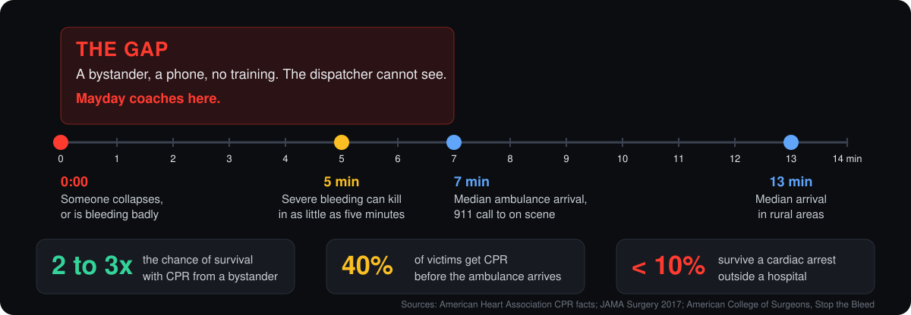
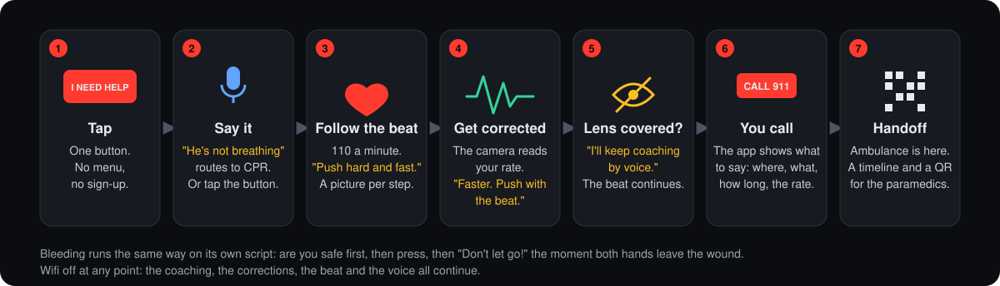
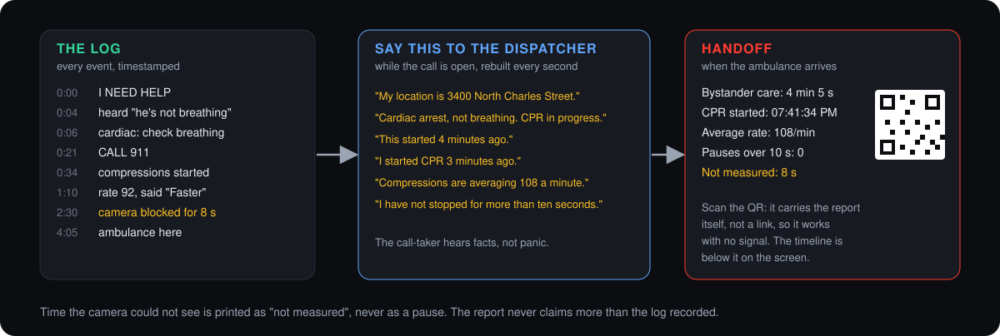
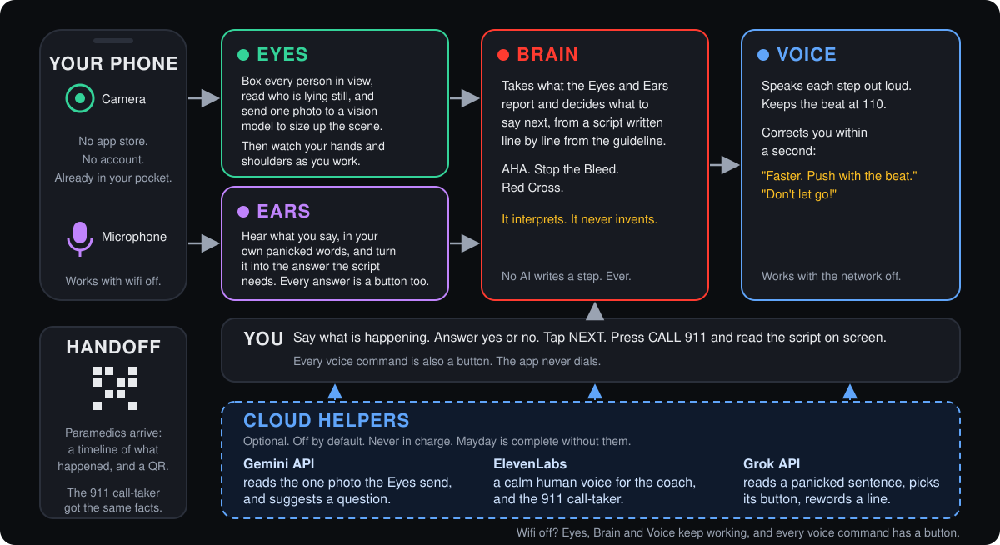
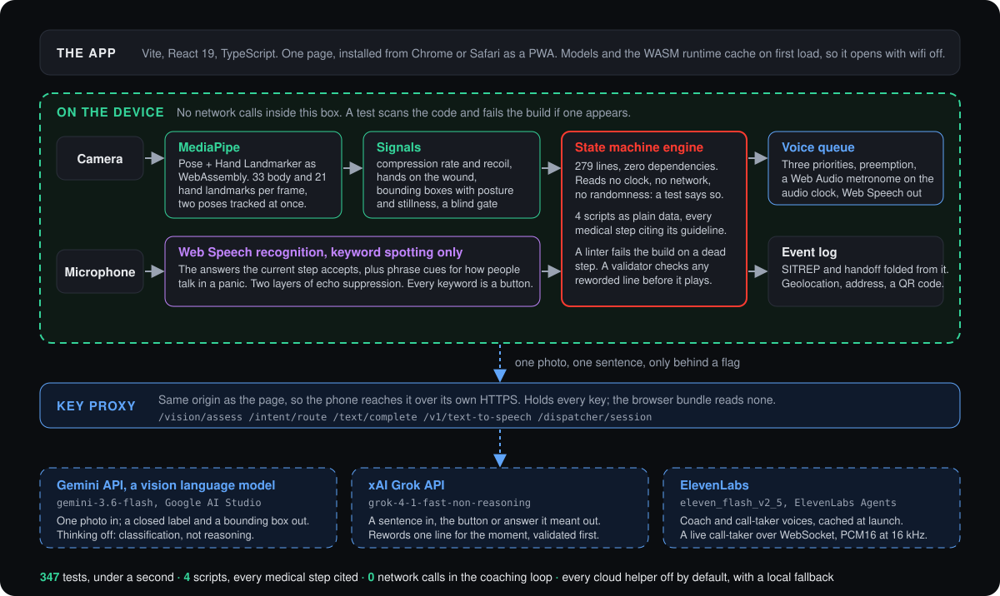

<p align="center">
  <picture>
    <source media="(prefers-color-scheme: dark)" srcset="docs/images/wordmark-dark.svg">
    
  </picture>
</p>

<p align="center"><strong>The minutes before the ambulance, coached.</strong></p>

> Built at HopHacks 2026, Johns Hopkins, September 18 to 20, for the Most Philanthropic Hack
> track, with the Gemini API, ElevenLabs and SpaceXAI sponsor challenges.

Mayday is an AI emergency dispatcher with eyes. A bystander opens it on a phone during a
medical emergency. It triages by voice, watches through the camera, and coaches them through
the correct first-aid protocol in real time until EMS arrives, then hands the paramedics a
structured report of what happened.

It is help in your pocket. No training, no account, no signal, and anyone standing next to
someone in trouble can act with it and give that person a chance. Every step it speaks comes
from a published guideline, written into the app as a script; the AI helps it see and hear and
never decides a step. Two emergencies ship today, cardiac arrest and severe bleeding, and adding
another is adding one file.

## 🚨 The problem

When someone collapses or starts bleeding badly, the people around them are the only help
there is until the ambulance arrives, and that takes seven minutes in most of the country and
thirteen in rural areas. Almost none of them are trained. The 911 dispatcher coaching them by
voice cannot see what they are doing, and they cannot tell whether they are doing it right. So
the minutes that decide whether the person lives are spent panicking, waiting, or doing the
right thing wrong. There is no real-time support for the person standing there, and that
person is the one who could be saving a life.

<p align="center">
  
</p>

Sources: [American Heart Association](https://cpr.heart.org/en/resources/cpr-facts-and-stats),
[JAMA Surgery, 2017](https://jamanetwork.com/journals/jamasurgery/fullarticle/2643992),
[American College of Surgeons, Stop the Bleed](https://www.facs.org/media-center/press-releases/2025/may-is-national-stop-the-bleed-month-learn-how-to-save-a-life-with-three-simple-actions/).

The knowledge that closes this gap is public and free: the American Heart Association's
hands-only CPR, the American College of Surgeons' Stop the Bleed, the Red Cross choking steps.
What does not exist is a way to put it in a frightened stranger's hands in the minutes that
matter, with someone watching whether they are doing it right. Video from the caller's phone to
a dispatcher changes the assessment in half of real calls ([BMC Emergency Medicine, 2021](https://link.springer.com/article/10.1186/s12873-021-00493-5)),
and an AI coach has out-performed dispatchers over audio ([JAMA Internal Medicine, 2026](https://today.ucsd.edu/story/ai-powered-cpr-coach-outperforms-911-dispatchers-in-guiding-bystander-resuscitation)).
Mayday puts the eyes on the phone itself.

## 💡 What a session looks like

<p align="center">
  
</p>

Bleeding runs on its own script: are you safe first, with no timer, then a circle locked around
the wound where your hands settle, and "Don't let go!" within about two seconds of both hands
leaving it.

### When the ambulance arrives, what the paramedic gets

<p align="center">
  
</p>

**Demo video:** the link lands with the Devpost submission.

## ❤️ Why this is philanthropy

In most emergencies the first responder is whoever happens to be there, and they want to help.
Mayday gives them a way, and gives it to everyone.

- It costs nothing and runs on any phone with a browser, with no account and no app store.
- It keeps coaching with no signal, which is exactly where the ambulance takes longest.
- It turns the first minutes from waiting into compressions at the right rate, or pressure
  that does not lift.
- It gives the dispatcher facts instead of panic: where, what, how long, the rate.
- It teaches the real guideline, step by step, every time it is used.

It does not replace the ambulance. It makes sure someone is doing the right thing until it
arrives.

## 🏗️ How it works

<p align="center">
  
</p>

## 🏆 Tracks and challenges

**Most Philanthropic Hack.** The whole product: free, offline, open source, teaching a published
guideline to whoever is standing there, and built so the people furthest from an ambulance get
the most from it. The section above on why this is philanthropy is the case.

**Best Use of Gemini API.** About a second into a session, one photo goes to Gemini with a strict
question: collapse, bleeding, choking, or unclear, with a box around the patient. The answer
becomes a spoken question, "It looks like someone is bleeding badly. Say yes, or tap.", and
nothing moves until the person says yes. The label is a closed list, so Gemini can suggest but
never invent a step.

**Best Use of ElevenLabs, Best Project Built with ElevenLabs.** The coach speaks as Brian, a low,
calm voice, with every line cached at launch so it keeps playing with wifi off. The 911
call-taker speaks as Sarah, a clearly different person, and with the live agent switched on it
is a real-time ElevenLabs Agents conversation that hears the phone's mic and is forbidden from
giving medical advice.

**Make it Legendary, SpaceXAI.** Grok, on the HopHacks xAI credits, is the text model behind two
switches. It reads a panicked sentence the app has no phrase for and picks the on-screen button
or the cited answer it meant, so "did I just crack something in his chest?" gets the rib answer
at once. And it rewords a line for the moment, so a repeated "Faster. Push with the beat." opens
with what you said and what the camera measured. Every rewording is checked against the step's
required words before it is spoken, or the line plays as written.

All three services are off by default, keep their keys on the server, and fall back to the
phone's own voice, ears and cues, so the app is complete without them.

## 🧭 Why you can trust it

Five rules the app is built around. Breaking one is a bug even if the feature works, and each
is enforced by a test a judge can open.

| Rule | In plain words | How the code enforces it |
|---|---|---|
| **Authority is deterministic** | Every instruction is a line a human transcribed from AHA, Stop the Bleed or the Red Cross. AI may sort or reword; it never picks or invents a step. | The build fails on a medical step with no cited guideline. A reworded line is checked for the words the step requires, and the original plays if the check fails. The engine may not read the clock, the network or a random number. |
| **Reflexes are local** | Camera to correction runs on the phone. Wifi off mid-session changes nothing in the coaching. | A test scans the coaching path for network calls. |
| **Cognition is episodic** | The cloud gets one photo at the start and one sentence when the app did not understand you. Never in the loop. No answer in time, nothing happens. | The camera, script and voice code cannot import the AI module. Every cloud call has a timeout and a local fallback. |
| **Fail loud, never wrong** | When the camera cannot see well, the numbers go blank, the app says so, and coaching continues by voice. Unwatched time is reported as unmeasured, never as a pause. | While blind, only lines marked safe may play. Unmeasured time is a named field in the report. |
| **A human dials 911** | The app never places a call. The call-taker in the demo is simulated, and the launch screen says so once. | A test fails on any phone-dialing code, requires the disclosure on the launch screen, and forbids the word "simulated" on the call itself. |

Behind that: 347 tests, four scripts with every medical step citing a live guideline page, an
engine of 279 lines with no dependencies, and zero network calls in the coaching loop. The
scripts are drawn from their data in [docs/protocol-diagrams.md](docs/protocol-diagrams.md).

## 🧰 Under the hood

<p align="center">
  
</p>

## 👀 What the camera measures

Pose and hand tracking run inside the browser, models included in the app, so no video ever
leaves the phone. It boxes everyone in view to read the scene, and during coaching it watches
the helper's hands and shoulders, which is where the corrections come from.

| It measures | How | Which becomes |
|---|---|---|
| Compression rate | the up-and-down of the helper's shoulders, peaks counted | "Faster. Push with the beat." or "A little slower." |
| Still pushing | at least two pushes in the last two seconds | "Don't stop. Keep pushing. Help is coming." |
| Chest recoil | how far the chest comes back up between pushes, an estimate | "Let the chest come all the way back up." |
| Hands on the wound | palms inside a circle locked where they first settled | "Don't let go! Hands back on the wound." |
| Confidence | whether the shoulders are visible enough to trust | the "I can't see you clearly" line, and the beat continues |
| The scene | a box around each person, their posture and stillness, and one photo to a vision model at the start | "Looks like Collapsed?", a question |

## 🚀 Run it

Needs Node 20.19 or newer and Chrome. The dev server serves self-signed HTTPS for the camera;
accept the warning once per device, scan the QR it prints with a phone on the same wifi, and
"Add to Home Screen".

```bash
npm install
```

```bash
npm run dev
```

| URL | What you get |
|---|---|
| plain | the real app |
| `?fake=1` | the whole loop on a laptop with no camera: a rate slider, cover the lens, lift hands |
| `?debug=1` | the sensor view: skeleton, waveform, rate, confidence |
| `?guide=1` | every step picture, no camera needed |
| `?flag=elevenLabs,dispatcherSim,sceneAssess,intentRoute,narrationFlavor` | the cloud helpers, any subset |

Keys go in `.env.local`, copied from `.env.example`: `GEMINI_API_KEY` for the photo,
`XAI_API_KEY` for Grok on the text routes, `ELEVENLABS_API_KEY` for the voices,
`ELEVENLABS_AGENT_ID` for the live call-taker. They never reach the browser. The phone notes,
the walkthrough for each switch and the checks the team walks before a judged run are in
[docs/12-run-and-check.md](docs/12-run-and-check.md).

## 🗂️ Repo layout

```
mayday/
├── src/                     the engine, no browser code in here
│   ├── perception/          camera, pose and hand tracking, the signals (docs/03)
│   ├── protocol/            the state machine engine, the linter, the paraphrase validator (docs/02)
│   │   └── machines/        one data file per emergency: triage, cardiac, bleeding, choking
│   ├── voice/               speaking (queue, metronome) and listening (keyword spotting) (docs/04, docs/09)
│   │   └── providers/       the one place a network call is allowed: ElevenLabs voice and agent, the key proxy
│   ├── ai/                  the cloud helpers behind interfaces: scene photo, sentence matching, rewording (docs/04, docs/11)
│   └── sitrep/              the event log, the SITREP, the paramedic handoff
├── web/                     the browser app
│   ├── session.ts           the orchestrator: where camera, engine, voice and log meet (docs/10)
│   ├── providers.ts         local by default, cloud behind a switch, chosen once per session
│   ├── geocode.ts           turns the GPS fix into a street address for the SITREP
│   └── ui/
│       ├── LaunchScreen.tsx, CameraView.tsx, DebugScreen.tsx, Waveform.tsx
│       ├── live/            the live screen: LiveApp, DispatcherPanel, HandoffPanel, useSession
│       └── guide/           one picture per line, gallery at ?guide=1 (docs/05)
├── docs/                    the context documents, reading order below
│   └── images/              the diagrams in this README
├── public/
│   ├── models/              MediaPipe model files, committed, nothing fetched at runtime
│   └── wasm/                MediaPipe runtime, generated on install, gitignored
├── scripts/                 prepare-assets, check-ai-boundaries, assess-frame, create-dispatcher-agent
└── tests/                   engine, scripts, keywords, validator, SITREP, boundaries, diagrams
```

## 📚 Docs

In reading order: [CLAUDE.md](CLAUDE.md) for the five rules and the scope,
[docs/01-architecture.md](docs/01-architecture.md) for the data flow and the threat model,
[docs/02-protocols.md](docs/02-protocols.md) for every script with its guideline,
[docs/03-perception.md](docs/03-perception.md) for the camera signals,
[docs/04-voice-and-apis.md](docs/04-voice-and-apis.md) for the voice queue and the AI seams,
[docs/05-ui-demo.md](docs/05-ui-demo.md) for the screens and the demo contract,
[docs/11-scene-assessment.md](docs/11-scene-assessment.md) for the research behind the eyes,
[docs/12-run-and-check.md](docs/12-run-and-check.md) for the run guide, and
[DECISIONS.md](DECISIONS.md) for every choice the docs did not settle.

## 👥 Team

- [Emmanuel Adedeji](https://www.linkedin.com/in/e-adedeji/)
- [Bryce Biyeba](https://www.linkedin.com/in/bryce-biyeba/)
- [Ricky Chen](https://www.linkedin.com/in/ricky-ch3n/)
- [Israel Ogwu](https://www.linkedin.com/in/israelogwu/)

## 📄 License

Apache License 2.0, full text in `LICENSE`. Attribution and the redistribution notice are in
`NOTICE`; keep that file with any copy or derivative you ship.

Mayday is a demonstration, not a certified medical device and not a substitute for emergency
medical services. The simulated dispatcher is never connected to a real emergency line. The
software is provided "as is", without warranty of any kind (LICENSE, Sections 7 and 8).
