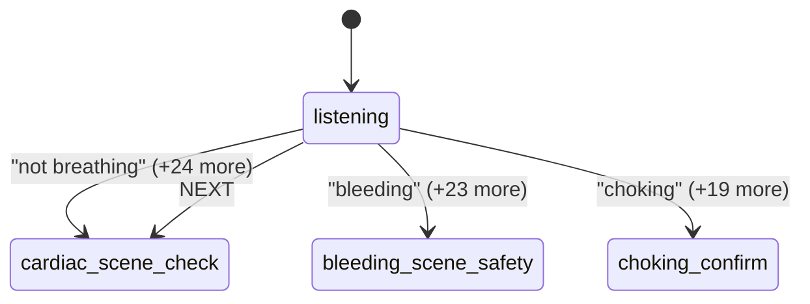
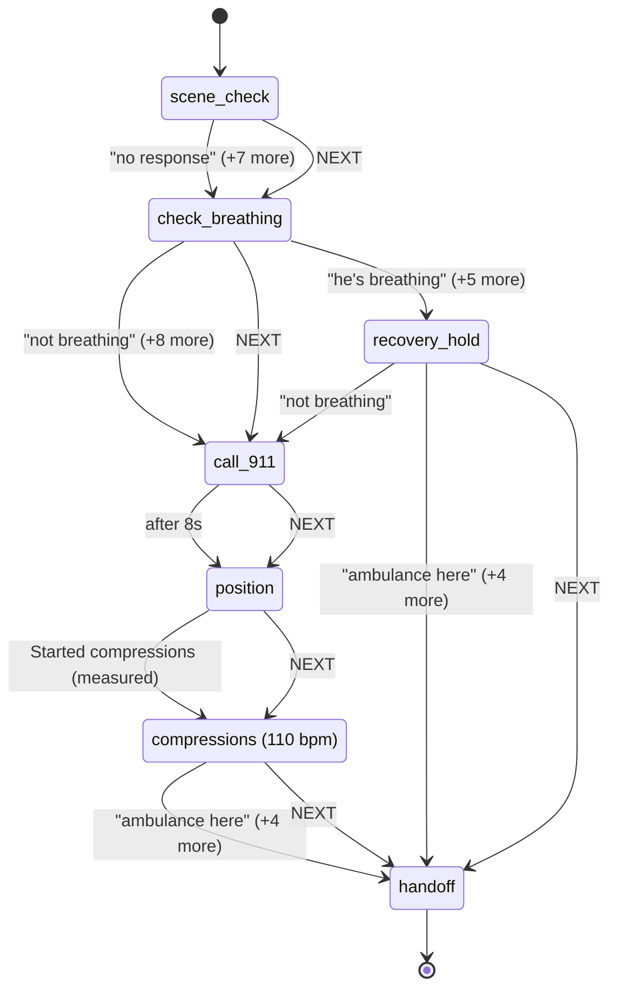
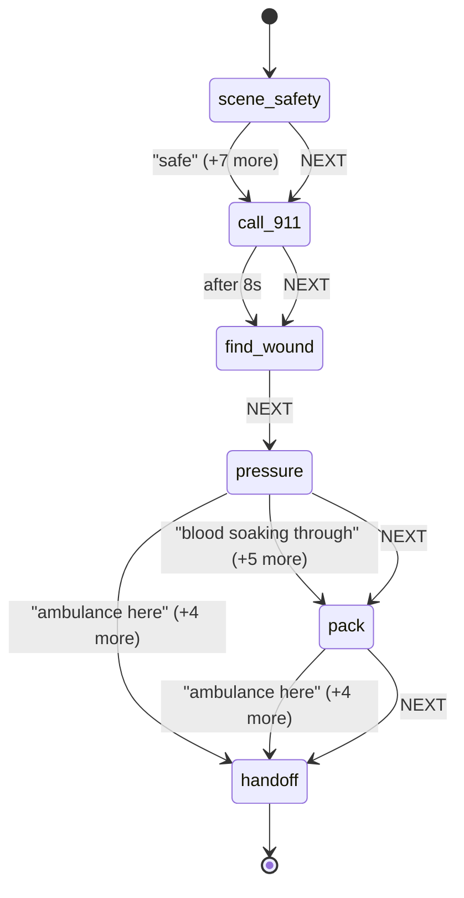
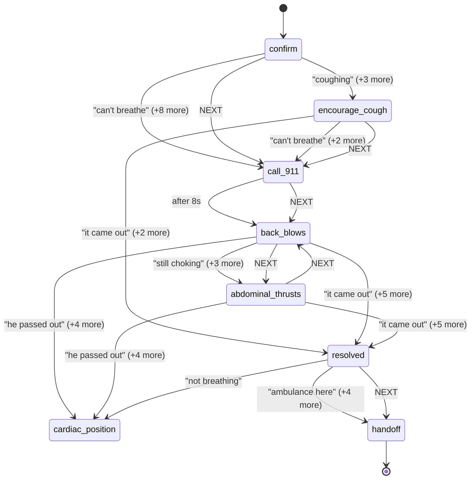

# Protocol diagrams

Generated from `src/protocol/machines`. Do not edit by hand: change the machine data and run
`npm run diagrams`. Every edge below is a transition the engine can actually take, and every
NEXT edge is a button on screen.

### triage

Source: routing only, no medical instruction

### cardiac

Source: https://cpr.heart.org/en/cpr-courses-and-kits/hands-only-cpr

### bleeding

Source: https://www.stopthebleed.org/

### choking

Source: https://www.redcross.org/take-a-class/resources/learn-first-aid/adult-child-choking

